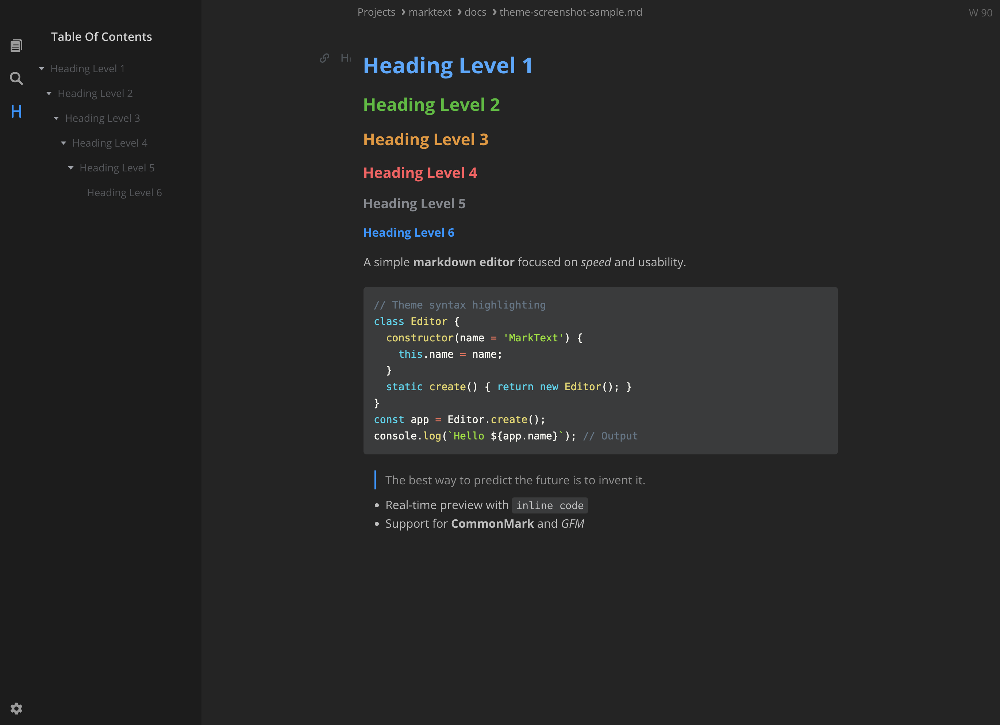
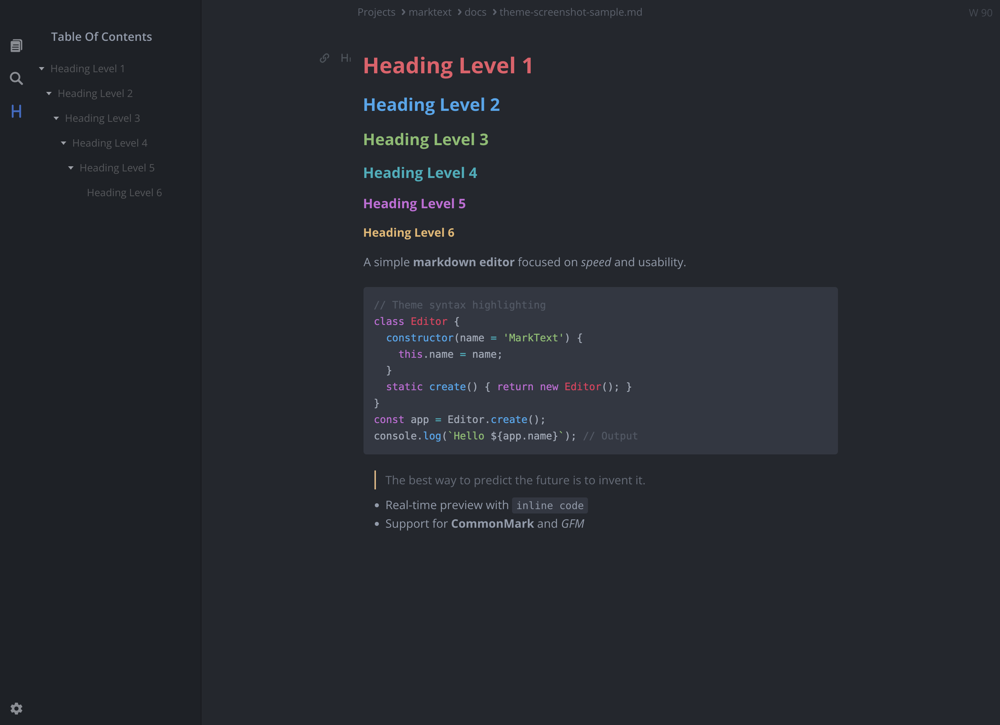
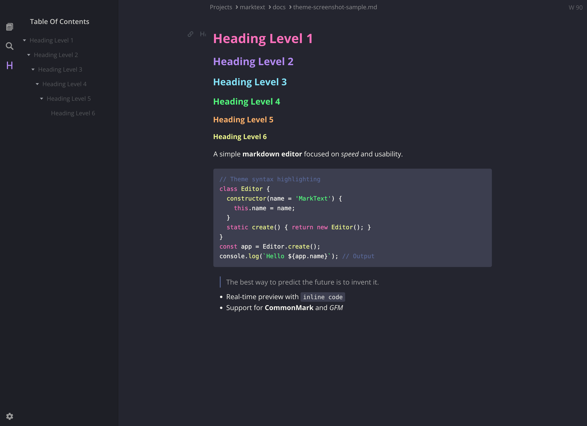
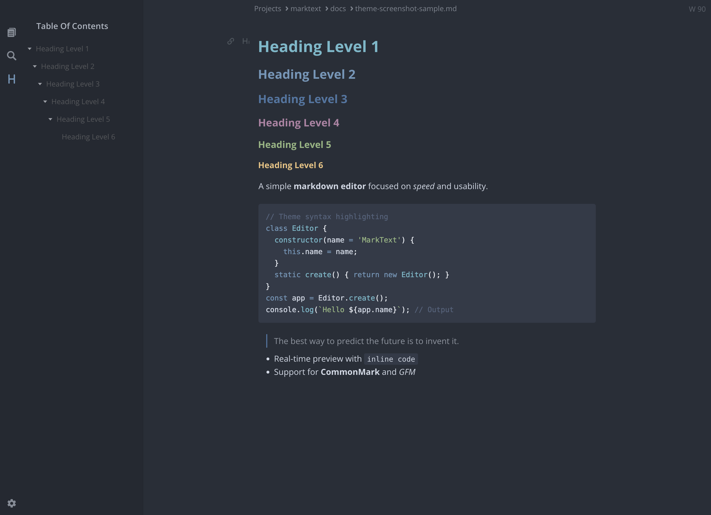

# Themes

MarkText includes 33 built-in themes organized into Light and Dark categories. Each theme provides a complete color scheme for the editor interface and syntax highlighting.

## Light Themes

| Theme | Description |
|-------|-------------|
| **Ayu Light** | Warm, comfortable light theme with soft colors |
| **Cadmium Light** | Clean, minimal light theme (default) |
| **Catppuccin Latte** | Soothing pastel theme with warm tones |
| **Everforest Light** | Nature-inspired green-tinted light theme |
| **Graphite Light** | Cool gray-toned light theme |
| **Gruvbox Light** | Retro groove with warm, earthy colors |
| **Rosé Pine Dawn** | Elegant theme with subtle rose accents |
| **Solarized Light** | Classic precision color scheme |
| **Tokyo Night Light** | Modern light variant of Tokyo Night |
| **Ulysses Light** | Inspired by the Ulysses writing app |

## Dark Themes

| Theme | Description |
|-------|-------------|
| **Ayu Dark** | Deep, comfortable dark theme |
| **Ayu Mirage** | Softer dark variant of Ayu |
| **Cadmium Dark** | Clean, minimal dark theme |
| **Catppuccin Mocha** | Rich, warm dark pastel theme |
| **cyberdream** | Neon-accented futuristic dark theme |
| **Dracula** | Popular purple-tinted dark theme |
| **Everforest Dark** | Nature-inspired forest dark theme |
| **Gruvbox Dark** | Retro groove with warm dark colors |
| **Horizon Dark** | Vibrant warm dark theme |
| **Kanagawa** | Inspired by Hokusai's Great Wave painting |
| **Material Dark** | Google Material Design dark theme |
| **Monokai Pro** | Professional variant of the classic Monokai |
| **Nightfox** | Cool-toned dark theme with good contrast |
| **Nord** | Arctic, bluish clean dark theme |
| **One Dark** | Atom editor's signature dark theme |
| **Oxocarbon Dark** | IBM Carbon-inspired minimal dark theme |
| **Palenight** | Elegant purple-tinted dark theme |
| **Rosé Pine** | Soho vibes with muted rose tones |
| **Rosé Pine Moon** | Darker variant of Rosé Pine |
| **Solarized Dark** | Classic precision dark color scheme |
| **Synthwave '84** | Retro 80s neon aesthetic |
| **Tokyo Night** | Modern VSCode-inspired dark theme |
| **Tokyo Night Storm** | Higher contrast Tokyo Night variant |

## Switching Themes

You can switch themes in several ways:

1. **Menu**: Go to `Theme` menu and select your preferred theme
2. **Preferences**: Open `Preferences` → `Theme` tab to preview and select themes
3. **Follow System**: Enable "Follow System Theme" to automatically switch between light and dark themes based on your system settings

## Theme Screenshots

### Light Themes

| Cadmium Light | Graphite Light |
|---------------|----------------|
|  |  |

| Ulysses Light | Catppuccin Latte |
|---------------|------------------|
|  |  |

### Dark Themes

| Dark | Material Dark |
|------|---------------|
|  |  |

| One Dark | Dracula |
|----------|---------|
|  |  |

| Nord | Tokyo Night |
|------|-------------|
|  |  |

## Custom Themes

Custom theme support is planned for a future release. In the meantime, you can use the "Custom CSS" option in Preferences → Theme to override theme styles.

## Theme Credits

Many of these themes are inspired by popular color schemes from the developer community:

- [Catppuccin](https://github.com/catppuccin/catppuccin) - MIT License
- [Dracula](https://github.com/dracula/dracula-theme) - MIT License
- [Everforest](https://github.com/sainnhe/everforest) - MIT License
- [Gruvbox](https://github.com/morhetz/gruvbox) - MIT License
- [Nord](https://github.com/nordtheme/nord) - MIT License
- [Rosé Pine](https://github.com/rose-pine/rose-pine-theme) - MIT License
- [Solarized](https://github.com/altercation/solarized) - MIT License
- [Tokyo Night](https://github.com/enkia/tokyo-night-vscode-theme) - MIT License
- [Gogh Themes](https://github.com/Gogh-Co/Gogh) - MIT License (color palette reference)
